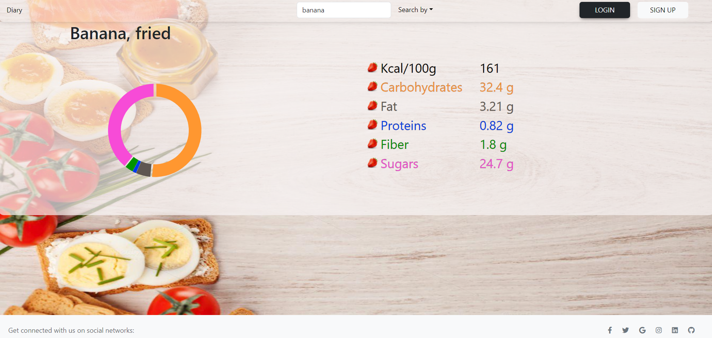
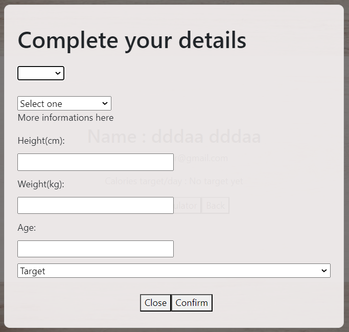
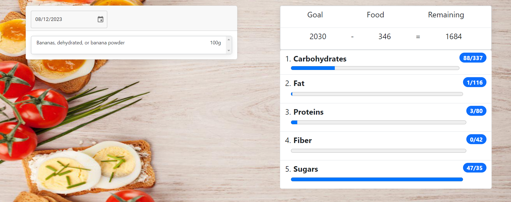

# NutriTraker

## Project Description

The purpose of this project is to help users to track their daily calories and nutrients consumed in order to manage to balance their food and archieve their goals in losing/gaining or maintaining weight.

### Technologies used:

- Express.js
- MongoDB
- React
- Vite
- Bootstrap
- Victory
- CSS
- Day.js
- Email-validator

We used Express.js to accelerate JavaScript application development, creating the necessary APIs for our frontend. MongoDB is a database that helpt us to easily store all the objects and datas we need to be stored. React, a popular web application library, was chosen for its effectiveness in creating interactive and dynamic UI components.Also Vite is a tool that made the devolping more fast and eficient. We used Bootstrap and Victory for impressive and responsive styling, along with custom CSS. Day.js helped in manipulating better dates for a good managing of how eated products are stored for each day. Also Email-validator offered us an official and good verification of the emails that users are using.

### Challenges

- Finding a propper API that could provide us a good data source for products and their nutrients was a bit complicated and how to extract and use parts of those datas in our database.
- Making a good schema of how the objects should look in database was tricky because we has to store huge objects for every user.

### Future Plans

- To make the app more user friendly and fixed some functionality bugs. Beeing a project for learnig new technologies we didn't get the time to focuss on small details.
- We would like to add an exercise plan funcionality that could be personalized.

## Setup

### Backend Setup:

1. **Install Dependencies:**

   - Navigate to the `server` directory in your terminal.
   - Run the following command to install the necessary dependencies:
     ```
     npm install
     ```
     (Alternatively, you can use `pnpm install`.)

2. **Run the Server:**
   - Once the dependencies are installed, run the following command to start the frontend:
     ```
     npm run dev
     ```
   - The server should now be up and running.

### Frontend Setup:

1. **Prerequisites:**

   - Make sure Node.js is installed and properly configured on your system.

2. **Install Dependencies:**

   - Navigate to the `client` directory in your terminal.
   - Run the following command to install the necessary dependencies:
     ```
     npm install
     ```
     (Alternatively, you can use `pnpm install`.)

3. **Run the Frontend:**
   - Once the dependencies are installed, run the following command to start the frontend:
     ```
     npm run dev
     ```
   - Click on the link provided in the terminal to open the page and experience NutriTraker!

### How to use

You can search for product by a name or by their barcode and you will receive their nutrients even without to login/ or signin

After a user will register he can upload in his profile his status and set a goal, then the calculator will tell how many calories and other nutrients that user should consume.

In the diary page the user can see his progress in completing daily goal food and how much he has left to consume.Also he can access and customize his previous days.


## Code Contributors

Baiacof Gheorghe-Valentin: https://github.com/Valentin1289
Gâlcă Marian: https://github.com/marianglc
Țeca Matei: https://github.com/matei-teca

